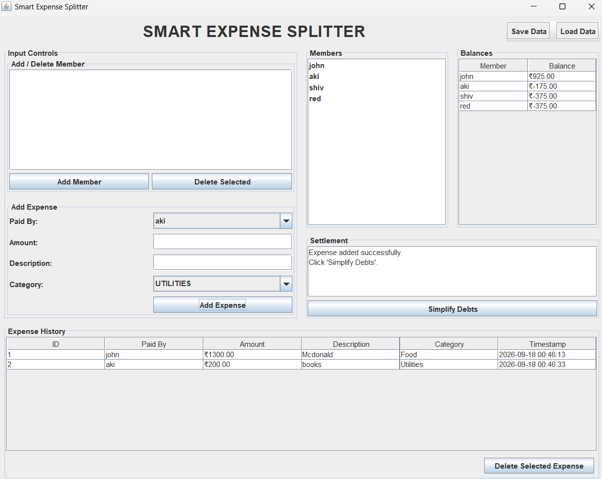
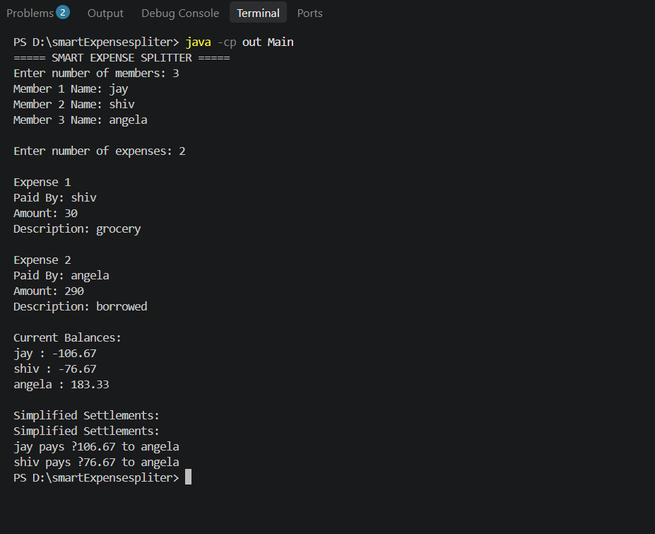

# Smart Expense Splitter: The Ultimate Group Finance Solution


## 📖 Comprehensive Project Overview

The **Smart Expense Splitter** is a highly robust, Java-based desktop application meticulously architected to solve the universally common and often frustrating problem of tracking, managing, and splitting shared group expenses. 

Whether you are coordinating a long-term living arrangement with roommates, organizing a multi-city vacation with friends, managing a departmental budget at work, or simply splitting a large dinner bill, calculating exactly who owes whom can quickly devolve into a complex mathematical and social challenge. 

This application takes the hassle, confusion, and potential for dispute out of collaborative expense sharing. It provides a centralized, transparent platform where users can log every shared cost down to the penny. The system calculates individual net balances in real-time and, as its crowning feature, employs a sophisticated, greedy debt-simplification algorithm. This algorithm optimizes the entire network of outstanding debts to minimize the total number of peer-to-peer monetary transactions required for everyone in the group to reach a zero balance.

## ✨ In-Depth Feature Breakdown

The Smart Expense Splitter goes beyond simple division, offering a comprehensive suite of tools designed for complete financial management:

### 1. Advanced Member & Group Management
* **Dynamic Roster:** Seamlessly add multiple members to your expense group at any time.
* **Integrity Checks:** The system automatically prevents the addition of duplicate member names to ensure data consistency.
* **Safe Deletion:** Remove members if they are no longer participating, with the system gracefully handling associated data.

### 2. Granular Expense Tracking & Auditing
* **Detailed Record Keeping:** Record expenses with precise, comprehensive details including the Payer's name, the exact Amount, a descriptive Note, the specific Category, and an auto-generated Timestamp.
* **Categorical Analytics Readiness:** Supported expense categories include: **Food, Transport, Entertainment, Utilities, and Other**. This categorization lays the groundwork for future budgetary analytics.
* **Immutable Audit Trail:** View a complete, chronologically ordered, and uneditable history of all expenses logged within a dedicated data table.
* **Dynamic Recalculation:** Make a mistake? You can select and delete erroneous expenses. The core engine will instantly and accurately recalculate all individual balances to reflect the change.

### 3. Intelligent Debt Simplification (The Core Algorithm)
* **Real-Time Net Balances:** The application constantly maintains a running ledger. It automatically calculates net balances for all members (a positive balance means they are owed money; a negative balance means they owe money).
* **Algorithmic Optimization:** Instead of a chaotic web of transactions (e.g., A pays B, B pays C, C pays A), the built-in mathematical algorithm analyzes the net balances of all "creditors" and "debtors" and computes the absolute most efficient, minimized set of settlement instructions required for the group to settle up.

### 4. Reliable Data Persistence
* **Save State Capability:** Never lose your financial data. Save your group's members and all historical expenses to a local, structured data file (`data.dat`) with a single click.
* **Seamless Resumption:** Load your previously saved data in future application sessions to pick up exactly where you left off, making it perfect for long-term usage like roommate living arrangements.

### 5. Professional & Intuitive User Interface
* **Java Swing Integration:** Built using Java's robust Swing framework, offering a clean, responsive, and native-feeling desktop experience.
* **Optimized Layout:** The interface is carefully organized with clear, distinct panels for input controls, interactive member lists, real-time balance tables, and a dedicated, easy-to-read settlement view.

### 6. Enterprise-Grade Underpinnings
* **Robust Form Validation:** The application actively prevents bad data entry. It blocks empty names, negative monetary amounts, and invalid characters, providing clear error feedback to the user.
* **Integrated Logging System:** Utilizes `java.util.logging` to silently track all major application events, data state changes, and potential errors, saving them to a persistent `logs/app.log` file for debugging and auditing.

---

## 🛠️ Technologies & Architectural Stack

The project is built upon a solid foundation of modern Java technologies, emphasizing modularity and maintainability:

* **Core Programming Language:** Java 17 (Leveraging modern language features)
* **Graphical User Interface:** Java Foundation Classes (JFC) / Swing (AWT)
* **Automated Testing:** JUnit 5 (Jupiter API) for rigorous algorithmic validation
* **Logging Framework:** `java.util.logging` (JUL)
* **Design Pattern:** Inspired by the Model-View-Controller (MVC) architecture, strictly separating data models (`model/`), utility and helper classes (`util/`), and presentation logic (`gui/`).

---

## 📸 Application Screenshots

### 1. The Main Dashboard: Input Controls and Real-Time Balances
*This view demonstrates the primary interface where users can manage group members, log new categorized expenses, and instantly view the shifting net balances of the group.*


### 2. Expense History & Algorithmic Settlement
*This view highlights the comprehensive, timestamped expense audit trail, alongside the results of the debt simplification algorithm detailing exactly who needs to pay whom.*


---

## 🚀 Complete Installation & Setup Guide

Getting the Smart Expense Splitter running on your local machine is a straightforward process.

### Step 1: System Prerequisites
Ensure you have the **Java Development Kit (JDK) 17** or higher installed and properly configured in your system's PATH. You can verify your installation by opening a terminal and typing `javac -version`.

### Step 2: Clone the Repository
Download the source code to your local machine using Git:
```bash
git clone https://github.com/akaksh001/Smart-expense-simplifier.git
cd Smart-expense-simplifier
```

### Step 3: Compile the Source Code
Compile the main application classes, the GUI components, and the utility classes. Place the compiled `.class` files in the `out` directory:
```bash
# For Windows (Command Prompt / PowerShell)
javac -d out Main.java model\*.java gui\MainFrame.java util\AppLogger.java

# For macOS / Linux (Bash)
javac -d out Main.java model/*.java gui/MainFrame.java util/AppLogger.java
```

### Step 4: Launch the Application
Run the graphical application by executing the compiled `MainFrame` class:
```bash
java -cp out gui.MainFrame
```
*(Note: If you prefer a text-based interface, you can alternatively run `java -cp out Main` to launch the console-only mode).*

---

## 🧪 Comprehensive Testing Instructions

Ensuring the mathematical accuracy of the debt simplification algorithm is paramount. The project includes a robust suite of automated tests covering the core models and logic.

1. **Verify JUnit Dependency:**
   Ensure that the standalone JUnit 5 console runner (`junit-platform-console-standalone-1.10.2.jar`) is present inside the `lib/` directory of the project.
2. **Compile the Test Suite:**
   Compile the source code alongside the test classes, ensuring the JUnit JAR is on the classpath:
   ```bash
   # For Windows
   javac -d out -cp "lib\junit-platform-console-standalone-1.10.2.jar;." Main.java model\*.java util\AppLogger.java test\*.java
   
   # For macOS / Linux
   javac -d out -cp "lib/junit-platform-console-standalone-1.10.2.jar:." Main.java model/*.java util/AppLogger.java test/*.java
   ```
3. **Execute the Tests:**
   Run the test suite using the JUnit console launcher:
   ```bash
   # For Windows
   java -jar lib\junit-platform-console-standalone-1.10.2.jar --class-path out --scan-classpath
   
   # For macOS / Linux
   java -jar lib/junit-platform-console-standalone-1.10.2.jar --class-path out --scan-classpath
   ```
   *Upon successful execution, you should see output confirming that all 16/16 tests have passed successfully, validating the core financial logic.*

---

## 🔮 Roadmap and Future Enhancements
While the current version provides a complete end-to-end solution, future iterations of the Smart Expense Splitter are planned to include:
* **Asymmetrical Expense Splitting:** Allowing expenses to be split unevenly (e.g., splitting by custom percentages, specific fixed amounts, or excluding specific members from a particular bill).
* **Data Exporting & Reporting:** Giving users the ability to export the settlement plan and expense history to PDF or Excel (CSV) formats for sharing.
* **Multi-Currency Support:** Integrating real-time currency conversion rates for groups traveling internationally.
* **Data Visualization:** Adding graphical charts (pie charts, bar graphs) to visualize spending habits by category over time.

---
*Conceptualized, designed, and developed as part of the VITyarthi Flipped Course Evaluation academic requirements.*
