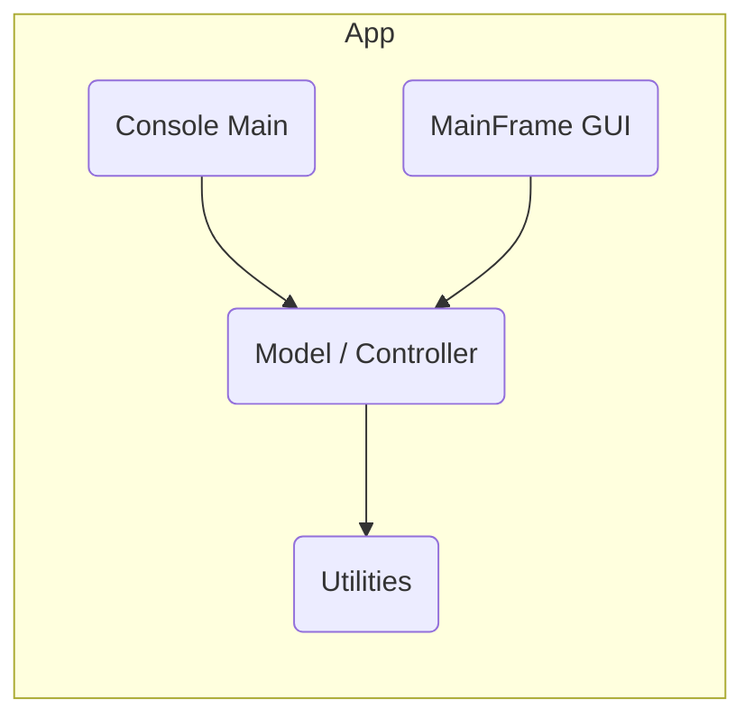

```mermaid
flowchart TD
    subgraph App ["App"]
        direction TB
        main(Console Main)
        gui(MainFrame GUI)
        model(Model / Controller)
        utils(Utilities)
    end
    
    main --> model
    gui --> model
    
    model --> utils
```
