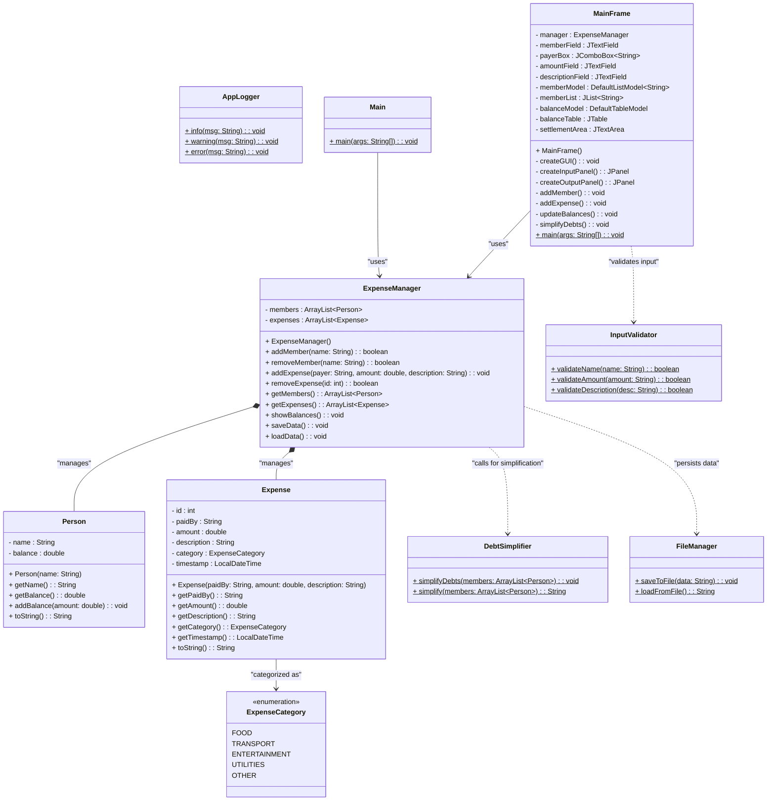

```mermaid
classDiagram
    class Person {
        - name : String
        - balance : double
        + Person(name: String)
        + getName() : String
        + getBalance() : double
        + addBalance(amount: double) : void
        + toString() : String
    }

    class ExpenseCategory {
        <<enumeration>>
        FOOD
        TRANSPORT
        ENTERTAINMENT
        UTILITIES
        OTHER
    }

    class Expense {
        - id : int
        - paidBy : String
        - amount : double
        - description : String
        - category : ExpenseCategory
        - timestamp : LocalDateTime
        + Expense(paidBy: String, amount: double, description: String)
        + getPaidBy() : String
        + getAmount() : double
        + getDescription() : String
        + getCategory() : ExpenseCategory
        + getTimestamp() : LocalDateTime
        + toString() : String
    }

    class ExpenseManager {
        - members : ArrayList~Person~
        - expenses : ArrayList~Expense~
        + ExpenseManager()
        + addMember(name: String) : boolean
        + removeMember(name: String) : boolean
        + addExpense(payer: String, amount: double, description: String) : void
        + removeExpense(id: int) : boolean
        + getMembers() : ArrayList~Person~
        + getExpenses() : ArrayList~Expense~
        + showBalances() : void
        + saveData() : void
        + loadData() : void
    }

    class DebtSimplifier {
        + simplifyDebts(members: ArrayList~Person~) : void$
        + simplify(members: ArrayList~Person~) : String$
    }

    class FileManager {
        + saveToFile(data: String) : void$
        + loadFromFile() : String$
    }

    class InputValidator {
        + validateName(name: String) : boolean$
        + validateAmount(amount: String) : boolean$
        + validateDescription(desc: String) : boolean$
    }

    class AppLogger {
        + info(msg: String) : void$
        + warning(msg: String) : void$
        + error(msg: String) : void$
    }

    class MainFrame {
        - manager : ExpenseManager
        - memberField : JTextField
        - payerBox : JComboBox~String~
        - amountField : JTextField
        - descriptionField : JTextField
        - memberModel : DefaultListModel~String~
        - memberList : JList~String~
        - balanceModel : DefaultTableModel
        - balanceTable : JTable
        - settlementArea : JTextArea
        + MainFrame()
        - createGUI() : void
        - createInputPanel() : JPanel
        - createOutputPanel() : JPanel
        - addMember() : void
        - addExpense() : void
        - updateBalances() : void
        - simplifyDebts() : void
        + main(args: String[]) : void$
    }

    class Main {
        + main(args: String[]) : void$
    }

    MainFrame --> ExpenseManager : "uses"
    Main --> ExpenseManager : "uses"
    ExpenseManager *-- Person : "manages"
    ExpenseManager *-- Expense : "manages"
    Expense --> ExpenseCategory : "categorized as"
    ExpenseManager ..> DebtSimplifier : "calls for simplification"
    ExpenseManager ..> FileManager : "persists data"
    MainFrame ..> InputValidator : "validates input"
```
