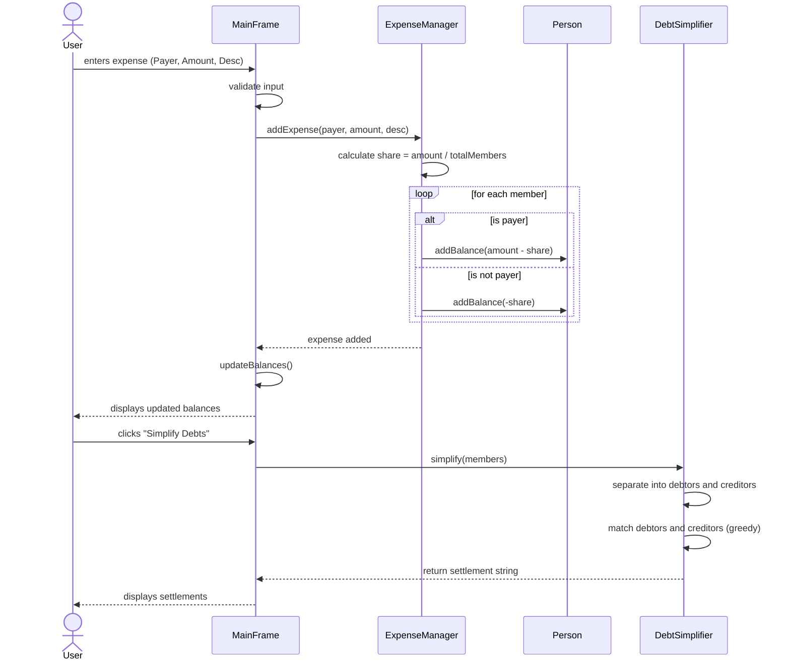

```mermaid
sequenceDiagram
    actor User
    participant MainFrame
    participant ExpenseManager
    participant Person
    participant DebtSimplifier

    User->>MainFrame: enters expense (Payer, Amount, Desc)
    MainFrame->>MainFrame: validate input
    MainFrame->>ExpenseManager: addExpense(payer, amount, desc)
    ExpenseManager->>ExpenseManager: calculate share = amount / totalMembers
    
    loop for each member
        alt is payer
            ExpenseManager->>Person: addBalance(amount - share)
        else is not payer
            ExpenseManager->>Person: addBalance(-share)
        end
    end
    
    ExpenseManager-->>MainFrame: expense added
    MainFrame->>MainFrame: updateBalances()
    MainFrame-->>User: displays updated balances
    
    User->>MainFrame: clicks "Simplify Debts"
    MainFrame->>DebtSimplifier: simplify(members)
    DebtSimplifier->>DebtSimplifier: separate into debtors and creditors
    DebtSimplifier->>DebtSimplifier: match debtors and creditors (greedy)
    DebtSimplifier-->>MainFrame: return settlement string
    MainFrame-->>User: displays settlements
```
