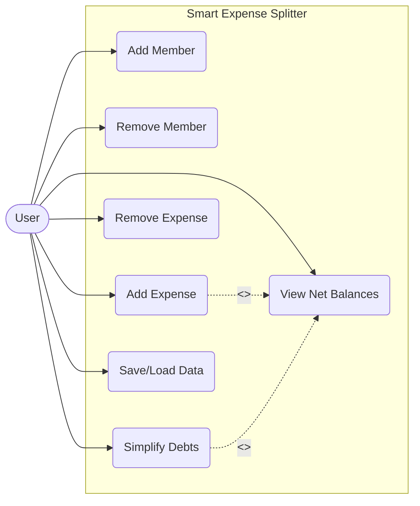

```mermaid
flowchart LR
    User([User])

    subgraph "Smart Expense Splitter"
        direction TB
        UC1(Add Member)
        UC2(Remove Member)
        UC3(Add Expense)
        UC4(Remove Expense)
        UC5(View Net Balances)
        UC6(Simplify Debts)
        UC7(Save/Load Data)
    end

    User --> UC1
    User --> UC2
    User --> UC3
    User --> UC4
    User --> UC5
    User --> UC6
    User --> UC7

    UC3 -. "<<include>>" .-> UC5
    UC6 -. "<<include>>" .-> UC5
```
