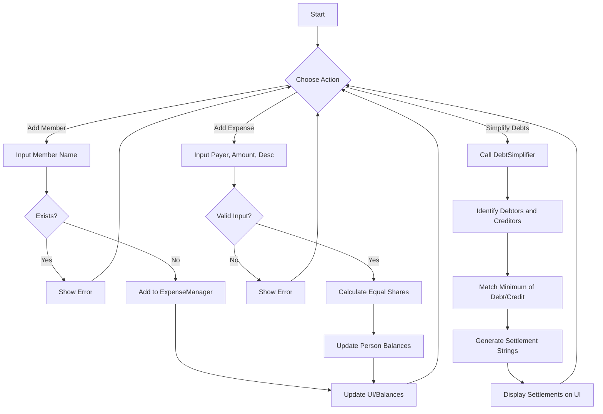

```mermaid
flowchart TD
    A[Start] --> B{Choose Action}
    
    B -->|Add Member| C[Input Member Name]
    C --> D{Exists?}
    D -->|Yes| E[Show Error]
    D -->|No| F[Add to ExpenseManager]
    F --> G[Update UI/Balances]
    
    B -->|Add Expense| H[Input Payer, Amount, Desc]
    H --> I{Valid Input?}
    I -->|No| J[Show Error]
    I -->|Yes| K[Calculate Equal Shares]
    K --> L[Update Person Balances]
    L --> G
    
    B -->|Simplify Debts| M[Call DebtSimplifier]
    M --> N[Identify Debtors and Creditors]
    N --> O[Match Minimum of Debt/Credit]
    O --> P[Generate Settlement Strings]
    P --> Q[Display Settlements on UI]
    
    E --> B
    G --> B
    J --> B
    Q --> B
```
